Задания для 4-ой ЛР

# 1. Тренировка создания HTML форм (можно посмотреть часть в видео лекции)

В шаблоне `template_form.html` из `app/templates/app` создан прототип шаблона в блоке ограниченном тегами `<form></form>`

Ваша заключается в создании нескольких строк ввода:
* поле для email (`<input type="email">`)
* поле для пароля(`<input type="password">`),
* поле для даты(`<input type="date">`), 
* поле для ввода целого числа (`<input type="number">`),
* поле для переключателя (`<input type="checkbox">`)

Атрибуты и текст остаётся за вами.

Проверить как отображается ваша форма можно по адресу http://127.0.0.1:8000/template/ (помним, что сервер должен быт запущен)

Список возможных команд HTML при создании строк ввода приведен в `form.md` из `tasks/lab4`. Советую больше обратить внимание на 
на блок `1.Базовое поле ввода`, где рассматривается тег `<input>`, остальное уже по желанию.

Помните, что при нажатии на кнопку, происходит сбор параметров из формы и передача их в теле запроса HTTP. Но значения записываются
по ключам полученным из атрибута `name` в вашем поле `<input>`. Как пример допустим у вас есть поле `<input type='text' name='my_text'>`
данные в вашего поля передадутся в тело HTTP запроса по ключу `my_text`. Именно по этому ключу нужно искать информацию во входящем запросе 
на сервер.

В html коде вы найдете такую строку `<span><i class="fa fa-id-card"></i></span> ` рядом с полем ввода.
Это иконки fontawesome. Бесплатные иконки, которые вы можете использовать для форм и других разделов сайта.
Чтобы поменять иконку, перейдите на сайт https://fontawesome.ru/all-icons/ , выберете понравившуюся иконку, нажмите на неё и 
скопируйте название и вставьте в ваш блок `<i class="fa fa-id-card"></i>`. Строка с иконкой вида `<span><i class="fa ..."></i></span>` 
не является обязательной при желании её можно удалить. 

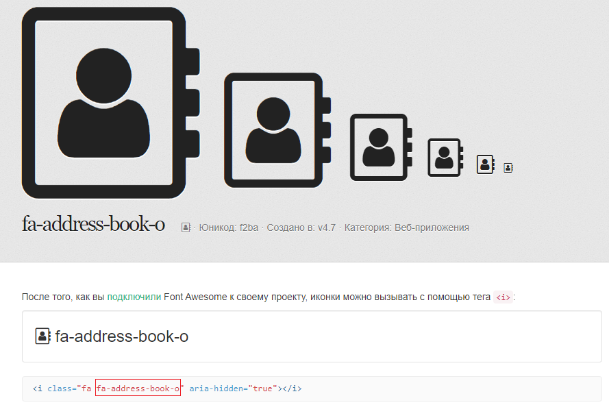

Кому интересно откуда вообще в HTML это возможно, то в разделе `<head>` вашего шаблона как раз они подгружаются и нужно просто 
выбрать нужные иконки

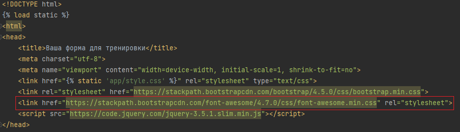

Затем как скомпоновали свою форму в `template_form.html` обработайте входящий post запрос

Для этого в теге `<form>` вашего `template_form.html` задайте атрибут `action=''` и `method='post'`. И не забываем под тегом
`<form>` указать ``, чтобы Django корректно отрабатывал формы с post запросами.

В итоге выглядеть будет так

```html
<form action="", method="post">
    
```

Затем в функции представлении `template_view` из `app/views.py` обработаем пост запрос. Самостоятельно решите что хотите 
обрабатывать, и верните какие-нибудь данные из как `HttpRequest` или `JsonResponse`.

# 2. Подключение своих форм (можно посмотреть часть в видео лекции)

После того как у вас удачно всё получилось (форма получает и возвращает данные), самое время воспользоваться механизмом форм
в Django.

Они нам нужны для более простой валидации и работы с данными из запроса.

Опишите ваши поля в классе `TemplateForm` файла `forms.py` в папке `app` которые вы хотите забирать из post запроса. 

**Помните поля должны называться точно также как названия полей в HTML (значение параметра name в `<input>`).**

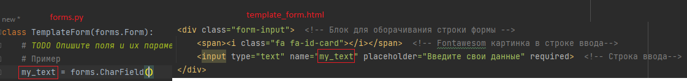

Необходимые классы для создания полей возьмите из описания в файле `forms.py`

Затем вернитесь в `views.py` в `template_view` и реализуйте подключение формы в представлении. Форма уже импортирована

```python
def template_view(request):
    if request.method == "GET":
        return render(request, 'app/template_form.html')

    if request.method == "POST":
        received_data = request.POST  # Приняли данные в словарь

        form = TemplateForm(received_data)  # Передали данные в форму
        if form.is_valid():  # Проверили, что данные все валидные
            my_text = form.cleaned_data.get("my_text")  # Получили очищенные данные
            my_select = form.cleaned_data.get("my_select")
            my_textarea = form.cleaned_data.get("my_textarea")
            
            # TODO Получите остальные данные из формы и сделайте необходимые обработки (если они нужны)

            # TODO Верните HttpRequest или JsonResponse с данными

        return render(request, 'app/template_form.html', context={"form": form})
```

Если всё сделано правильно, то теперь данные полученные из формы вернутся с сервера

Далее сделаем возможность вывода ошибок в случае получения ошибок валидации.

Работа с ошибками будет идти через вызов данных (form) передаваемых в шаблон, а у форм будет вызывать
errors, если они существуют, то выводим их.

До блока с кнопкой отправки добавьте

```python

    <div class="mb-3 d-flex align-items-center">
        <span style="color: red; font-size: 16px">{{ form.errors }}</span>
    </div>

```

Проверьте корректность отображения на поле ввода email на примере `a@a.a`


# 3. Работа со встроенными формами

В модуле Py110 мы авторизировали пользователя для работы с интернет магазином. В данном приложении тоже есть форма авторизации.

Перейти в неё можно или через главную страницу http://127.0.0.1:8000/ или по http://127.0.0.1:8000/login/

На данный момент в базе существует только 1 пользователь c данными (вводить без кавычек):

* `username = "user"`

* `password = "user"`

Авторизируемся под ним и нас перебросит в личный кабинет пользователя. Нажмем на кнопку внизу и выйдем из аккаунта.

Если посмотреть на код авторизации (`login_view` во `views.py`), то он выглядит достаточно знакомым,

В коде используется 
```python
user = authenticate(username=data["username"], password=data["password"])
```

Для получения пользователя из таблиц Django

Затем если пользователь существует, то авторизируем его при помощи

```python
login(request, user)
```

затем перебрасываем на страницу с его аккаунтом

```python
return redirect("app:user_profile")
```

Что-то похожее мы уже делали в интернет магазине при авторизации. Теперь воспользуемся встроенными формами по авторизации 
и регистрации пользователя.

Эти формы находятся в 

```python
from django.contrib.auth.forms import AuthenticationForm, UserCreationForm
```

Импортируйте их во `views.py`

Заменим код post метода `login_view` на:

```python
    if request.method == "POST":
        form = AuthenticationForm(request, request.POST)
        if form.is_valid():
            user = form.get_user()
            login(request, user)
            return redirect("app:user_profile")
        return render(request, "app/login.html", context={"form": form})
```
Теперь мы используем встроенную форму авторизации Django для поверки действительно ли есть такой пользователь среди 
пользователей в базе Django, если есть, то получаем его и авторизируем с последующим переходом в аккаунт пользователя.
Если произошли ошибки, то отправляем форму для последующего отображения ошибок.

Теперь аналогично можно авторизироваться под пользователем используюя стандартную форму авторизации. Однако у данной стандартной формы
есть один недостаток, чтобы она работала, то в форме должны быть 2 обязательных поля username и password, по другим данным 
стандартная форма не авторизует пользователя (допустим email (или номер телефона), password). Для других случаев нужно будет самостоятельно 
расширять форму и её обработку.

Теперь отобразим ошибки формы в `login.html`

Заменим

```html
<div class="mb-3 d-flex align-items-center">
    <span style="color: red; font-size: 16px">{{ error }}</span>
</div>
```
На

```html
<div class="mb-3 d-flex align-items-center">
    <ul style="color: red; font-size: 16px">
    
        
            <li>{{ field }}: {{ error }}</li>
        
    
    </ul>
</div>
```

Такое изменение позволит вывести все ошибки которые есть в форме как маркированный список

## Поработаем с регистрацией пользователя.

Для это используем встроенную форму `UserCreationForm`, для post метода `register_view`

```python
    if request.method == "POST":
        form = UserCreationForm(request.POST)
        if form.is_valid():
            user = form.save()  # Возвращает сохраненного пользователя из данных формы
            login(request, user)
            return redirect("app:user_profile")

        return render(request, 'app/register.html', context={"form": form})
```

UserCreationForm по умолчанию использует 3 поля (username, password1, password2), при валидации проверяется что password1
соответсвует нормам защищенности пароля, а password2 точная копия password1, в таком случае создаётся пользователь в базе
Django. Но у нас есть email, который не используется. Его можно добавить к пользователю, так как у пользователя в базе Django
по умолчанию есть поле email(подробнее про все концепции таблиц и моделей будет рассмотрено в курсе PyWeb).

Произведем простейшее расширение базовой регистрации добавив поле для проверки email адреса.

Для этого в `forms.py` приложения `app` создадим `CustomUserCreationForm` и отнаследуемся от `UserCreationForm` для
того, чтобы добавить ещё одно поле для проверок в тот функционал, что уже есть по умолчанию в Django.

```python
class CustomUserCreationForm(UserCreationForm):
    email = forms.EmailField(widget=forms.EmailInput)

    def save(self, commit=True):
        user = super().save(commit=False)
        user.email = self.cleaned_data["email"]
        if commit:
            user.save()
            if hasattr(self, "save_m2m"):
                self.save_m2m()
        return user
```

Затем мы переопределили метод save() который был у UserCreationForm, чтобы добавить ему функциональность добавления 
email пользователю c последующим сохранение его в базе Django.

Блок 
```python
if commit:
    user.save()
    if hasattr(self, "save_m2m"):
        self.save_m2m()
return user
```
Повторяет один в один код из исходного кода Django и его формы `UserCreationForm`, это сделано, чтобы не нарушить внутреннюю 
логику поведения сохранения пользователя.

Теперь у нашей обновленной формы появилась возможность валидировать email.

Осталось только импортировать `CustomUserCreationForm` в `views.py` и заменить `UserCreationForm`, на `CustomUserCreationForm`
в `register_view`

Теперь в случае передачи неверного email (допустим a@a.a) этот email не пройдёт валидацию, 
хотя валидацию на стороне клиента проходил.

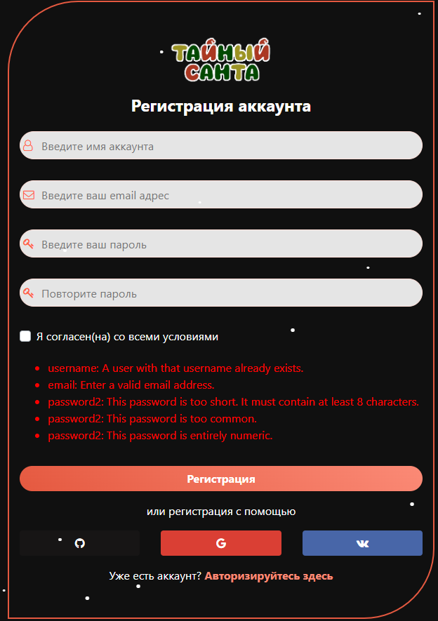


# 4. Настройка авторизации через сторонние сервисы, на примере github

Теперь подключим авторизацию через github для этого установим библиотеку 

`pip install social-auth-app-django`

Настроим приложение Django. В `settings.py` пропишем

```python
INSTALLED_APPS = [
    ...
    'social_django',
    ...
]


AUTHENTICATION_BACKENDS = (
   'social_core.backends.github.GithubOAuth2',
   'django.contrib.auth.backends.ModelBackend',
)

LOGIN_REDIRECT_URL = '/profile/' # Чтобы после авторизации перенаправлялось на страницу пользователя

SOCIAL_AUTH_GITHUB_KEY = ''
SOCIAL_AUTH_GITHUB_SECRET = ''
SOCIAL_AUTH_GITHUB_SCOPE = ['user:email', 'read:user']
```

Далее необходимо создание приложение на Github, для этого перейдите на страницу настроек вашей учетной записи на 
Github и выберите вкладку "Developer settings". 

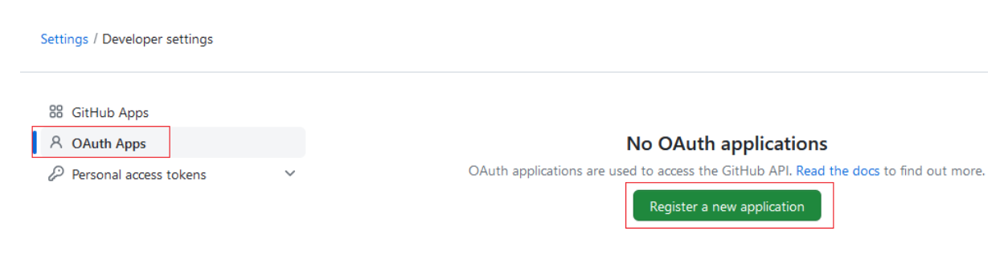


Затем нажмите кнопку "New OAuth App" и заполните необходимые поля. (`Важное замечание! 
Использование Github тем и хорошо для авторизации, что позволяет работать с локальным хостом, 
большинство авторизационных сервисов требует доступ к работающему домену (нужно будет поменять ссылку при деплое)`)

```python
http://127.0.0.1:8000  # Homepage URL

http://127.0.0.1:8000/auth/complete/github/  # Authorization callback URL
```

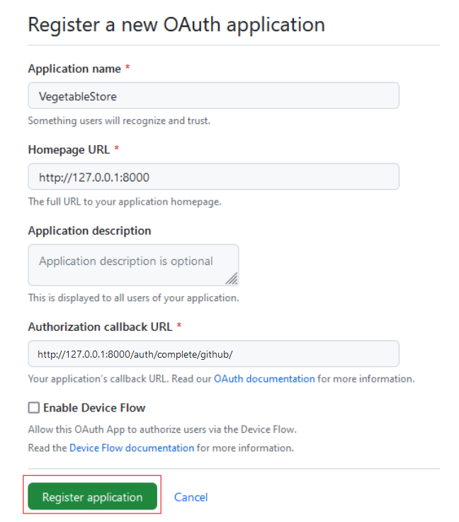

После создания приложения скопируйте "Client ID" и "Client Secret"(необходимо его 
создать, секретный ключ лучше сразу скопировать в `settings.py` об этом чуть ниже), 
эти данные будут использоваться для авторизации в вашем приложении Django.

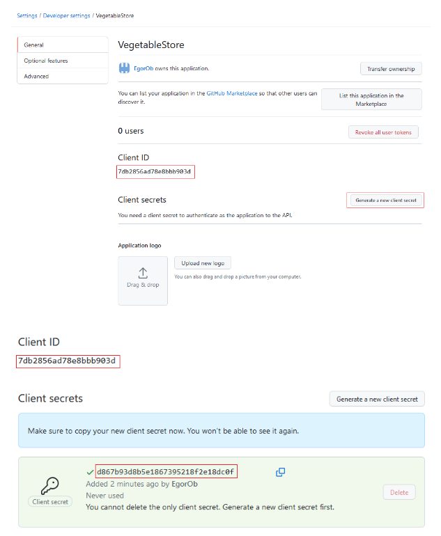

Далее копируем эти данные в `SOCIAL_AUTH_GITHUB_KEY` и `SOCIAL_AUTH_GITHUB_SECRET` 
в `settings.py` соответственно (скопировать свои данные)

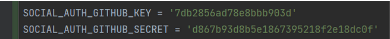

Добавьте следующие URL-адреса в корневой файл urls.py:

```python
path('auth/', include('social_django.urls', namespace='social'))
```

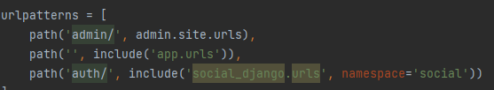

Далее пропишем ссылку на авторизацию через github в шаблоне `login.html`

```python
href=""
```

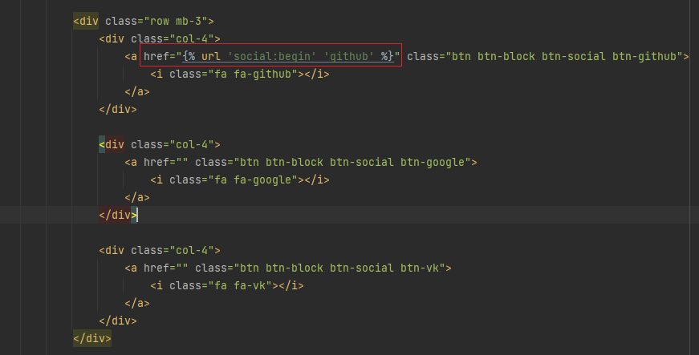

Произведем миграцию в БД, так как для хранения данных об авторизации необходимы таблицы.

`python manage.py migrate`


Теперь при нажатии на авторизацию через github перебрасывает на github, а затем при удачной 
авторизации - на стартовую страницу.

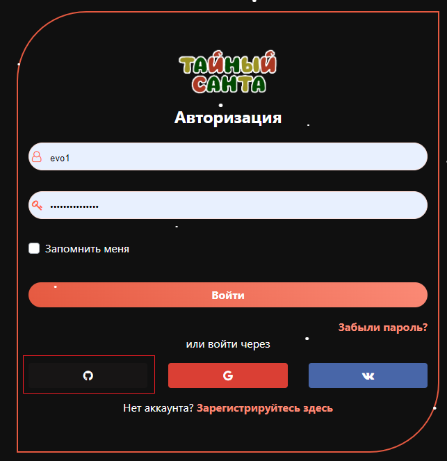

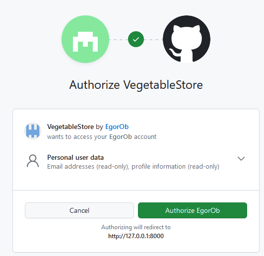


Теперь на сервис можно заходить под аккаунтом github.

Единственное, что нужно будет дописать, это в функцию login при регистрации во views.py приложения 
app добавить указание на то, каким образом будет проходить авторизация через форму

```python
login(request, user, backend='django.contrib.auth.backends.ModelBackend')  # Авторизируем пользователя
```

Это необходимо, чтобы избежать непонимания Django как именно производить регистрацию, так как теперь у нас 2 подхода к регистрации пользователей
классический(через форму) и через сервис github.

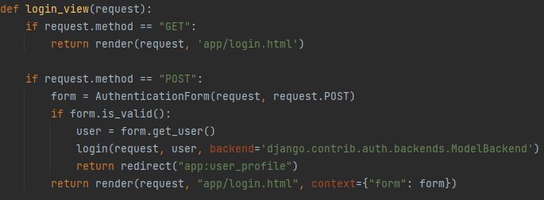


# Практика закончена