Задания для 5-ой практики + итоговое задание

# 1. Работа с CBV

Начнем постепенное упрощение функций представлений (дублирующего кода будет достататочно, 
но это сделаем, чтобы не терять, что было сделано ранее)

## 1.1 Использование View 

Перепишем `template_view` в `views.py` под концепцию CBV

Для этого во `views.py` импортируем

```python
from django.views import View
```

Затем создадим класс TemplateView, наследующийся от базового класса View

```python
class TemplView(View):
    def get(self, request):
        # TODO скопируйте код, что есть в template_view в теле условия request.method == "GET"
    
    def post(self, request):
        # TODO скопируйте код, что есть в template_view в теле условия request.method == "POST"
```

Для примера, что может получиться, но должны быть ваши данные!

```python
class TemplView(View):
    def get(self, request):
        return render(request, 'app/template_form.html')

    def post(self, request):
        received_data = request.POST  # Приняли данные в словарь

        form = TemplateForm(received_data)  # Передали данные в форму
        if form.is_valid():  # Проверили, что данные все валидные
            my_text = form.cleaned_data.get(
                "my_text")  # Получили очищенные данные
            my_select = form.cleaned_data.get("my_select")
            my_textarea = form.cleaned_data.get("my_textarea")

            return JsonResponse(form.cleaned_data)
        return render(request, 'app/template_form.html', context={"form": form})
```

Затем необходимо url конфигуратору сказать, чтобы вызывалось новое представление

Для этого в `urls.py` приложения `app` пропишем 

```python
from .views import TemplView

urlpatterns = [
    ...
    path('template/', TemplView.as_view(), name='template'),
    ...
]
```

Пропишите `path('template/', TemplateView.as_view(), name='template')` выше, чем прошлый
`path('template/', template_view, name='template'),`, чтобы маршрутизатор выполнял именно 
пример с классовым представлением, а не функциональным (помним, что выполняется представление то,
что выше при одинаковом маршруте).

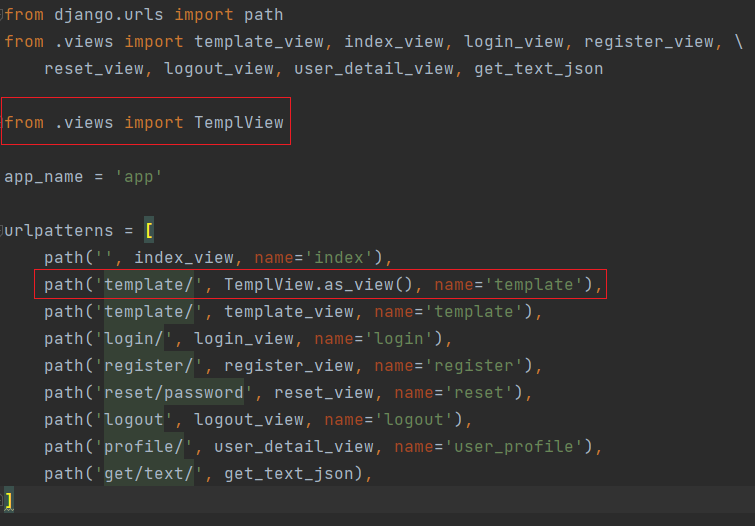

Импорт классового представления был намеренно отделен от функциональных, 
для визуального разграничения, на практике можно всё в одной строке делать, 
но главное, чтобы было читаемо.

После всех этих манипуляций, при переходе по http://127.0.0.1:8000/template/ ваша форма
не должна измениться, а будет выполнять ту же функциональность.

Следующим этапом будет использование Общих представлений (Generic View), для упрощения
задач.

## 1.2 Использование TemplateView 

Для классических задач отображения шаблона у Django существует общий класс представления TemplateView, 
который можно использовать для упрощения действий с вашим классом на базе View

Во `views.py` импортируем `TemplateView`

```python
from django.views.generic import TemplateView
```

Затем создадим новый класс `MyTemplView` на базе `TemplateView`

```python
class MyTemplView(TemplateView):
    template_name = 'app/template_form.html'
```

Данного кода достаточно для отображения вашего шаблона `app/template_form.html`.
Учтите, что в `template_name` вы прописываете путь к шаблону ровно такой эе как 
прописывали бы при передачи это пути в функцию `render`

Осталось только зарегистировать путь для данного представления.

В `urls.py` импортируйте `MyTemplView`, и добавьте его над существующими путями с `template/`, 
чтобы выполнялся именно он (просто чтобы вы видели какой код был ранее, до изменений)

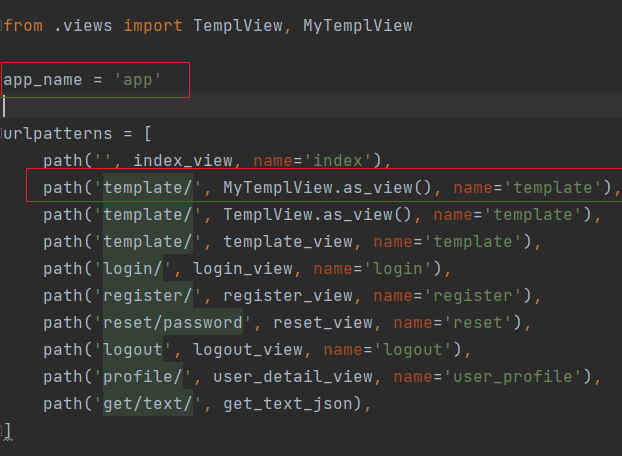

Теперь всё работоспособно, но до момента отправления данных из формы http://127.0.0.1:8000/template/

Появится белый экран, а в консоле появится сообщение, что метод POST не поддерживается

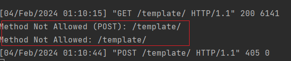

Это связано с тем, что по умолчанию считается, что шаблон рендерится (показывается) 
при методе GET, поэтому POST там просто не прописан, давайте его пропишем, так 
как никто этого не запрещает (на практике для этого существует другое представление, но сейчас мы обучаемся, что можно делать и как)

```python
class MyTemplView(TemplateView):
    template_name = 'app/template_form.html'
    
    def post(self, request, *args, **kwargs):
        # TODO прописываем всё что было в методе post в TemplView(View)
```

Но вместо `return render(request, 'app/template_form.html', context={"form": form})`
пропишите

```python
context = self.get_context_data(**kwargs)  # Получаем контекст, если он есть
context["form"] = form  # Записываем в контекст форму
return self.render_to_response(context)  # Возвращаем вызов метода render_to_response
```

В переменной context содержится контекст для шаблона (то, что передавали в переменную context в render).
Мы вызываем метод get_context_data, чтобы получить данные о контексте передаваемый в шаблон.
На практике get_context_data переопределяют и в нем определяют данные, которые потом пойдут в шаблон

Полный код в `MyTemplView` может выглядеть так

```python
class MyTemplView(TemplateView):
    template_name = 'app/template_form.html'

    def post(self, request, *args, **kwargs):
        received_data = request.POST  # Приняли данные в словарь

        form = TemplateForm(received_data)  # Передали данные в форму
        if form.is_valid():  # Проверили, что данные все валидные
            my_text = form.cleaned_data.get(
                "my_text")  # Получили очищенные данные
            my_select = form.cleaned_data.get("my_select")
            my_textarea = form.cleaned_data.get("my_textarea")

            return JsonResponse(form.cleaned_data)
        context = self.get_context_data(**kwargs)  # Получаем контекст, если он есть
        context["form"] = form  # Записываем в контекст форму
        return self.render_to_response(context)  # Возвращаем вызов метода render_to_response
```

Теперь форма снова работает как нужно.

## 1.3 Использование FormView 

Наследование от `TemplateView` хорошо для тех задач, где необходимо просто
отрендерить(составить HTML страницу подставив данные в шаблон) страницу. Данные для подставления
в шаблон `context` определяются в методе `get_context_data`.

Но для задач получения данных с формы существует расширение класса на базе `TemplateView`
под названием `FormView`, которое специализируется на обработке данных с `post` запроса
и при удачной валидации производит редирект на нужную страницу, а `get` запрос 
обрабатывает как `TemplateView`.

Создадим новое классовое представление `MyFormView`, для этого импортируем `FormView`

```python
from django.views.generic import FormView
```

Создадим `MyFormView`

```python
class MyFormView(FormView):
    template_name = 'app/template_form.html'  # Шаблон который будет рендерится
    form_class = TemplateForm  # Класс формы который будет валидироваться
    success_url = '/'  # Ссылка для перехода при удачной валидации
```

По стандарту создадим маршрут на `urls.py`

```python
    path('template/', MyFormView.as_view(), name='template'),
```

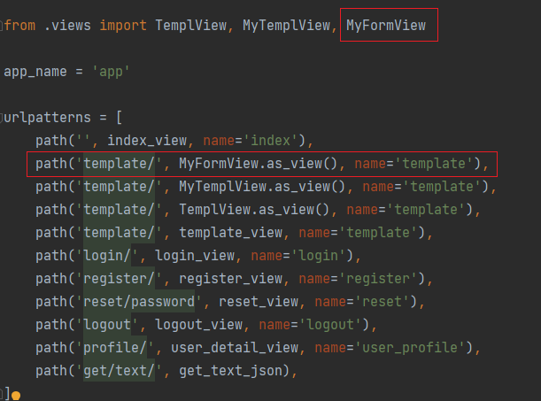

Теперь в случае успешной валидации формы будет переход, на ссылку `success_url` 
в данном примере это будет стартовая страница.

##### _____ Теоретический блок ________

Данный подход короткий, но убирает часть функциональности что у нас есть, допустим
при удачной валидации нет возвращения JsonRensponse, который мы и поправим.

Если посмотреть как внутри `FormView` определены методы `get` и `post`, то можно
что для `get` вызывается метод `render_to_response` (это аналог render), а для
`post` если форма валидна, то метод `form_valid`, а если нет - `form_invalid`

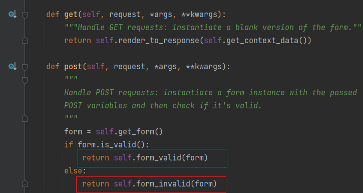

А сам код `form_valid` и `form_invalid` выгладит в `FormView` следующим образом

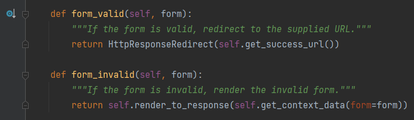

##### _____ Практический блок ________

Воспользуемся переопределением метода `form_valid` для нашей задачи, чтобы при удачной
валидации формы возвращался JsonResponse c данными

```python
def form_valid(self, form):
    return JsonResponse(form.cleaned_data)
```

Тогда общий код будет выглядеть так

```python
class MyFormView(FormView):
    template_name = 'app/template_form.html'
    form_class = TemplateForm
    success_url = '/'

    def form_valid(self, form):
        return JsonResponse(form.cleaned_data)
```

Данный код повторяет полностью функционал, что был ранее описан в `TemplView` или `template_view`

## 1.4 Использование встроенных Общих авторизационных представлений

На прошлой практике мы поработали с встроенными авторизационными формами, но на самом деле
если и встроенные формы представления для авторизации, на базе `FormView`

Проведём авторизацию для `login_view`

```python
from django.contrib.auth.views import LoginView
```

```python
class MyLoginView(LoginView):
    template_name = 'app/login.html'
    redirect_authenticated_user = True  # Данный флаг не позволит авторизированному 
    # пользователю зайти на страницу с авторизацией и сразу его перенаправит на 
    # ссылку редиректа. По умолчанию redirect_authenticated_user = False
```

По стандарту создадим путь для формы авторизации

```python
    path('login/', MyLoginView.as_view(), name='login'),
```

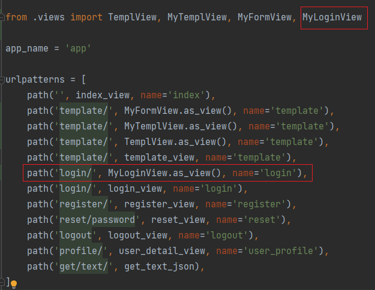

Теперь при авторизации ничего не изменилось, а кода стало меньше. При успешной 
авторизации нас перенаправляют на /profile/, так как это прописано в `settings.py`

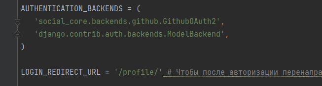

Однако можно заметить, что зачем создавать целый класс, чтобы отнаследоваться и поменять
там пару классовых атрибутов, нельзя ли сделать это ещё проще? Да, для задач где вам не нужно
писать свой код с специфичной логикой авторизации и т.д., где просто работаем с классовыми
атрибутами, где прописываем пути и действия для стандартного механизма, то данные значения можно передать
непосредственно в сам базовый класс и в `urls.py` просто его вызвать. Давайте так и сделаем на примере
нашего базового класса `LoginView`

Для этого в `urls.py` импортируем класс `LoginView`

```python
from django.contrib.auth.views import LoginView
```

А в `urlpatterns` пропишем

```python
urlpatterns = [
    ...
    path('login/', LoginView.as_view(template_name='app/login.html', redirect_authenticated_user=True), name='login'), 
    ...
]
```

В общем виде это будет выглядеть так

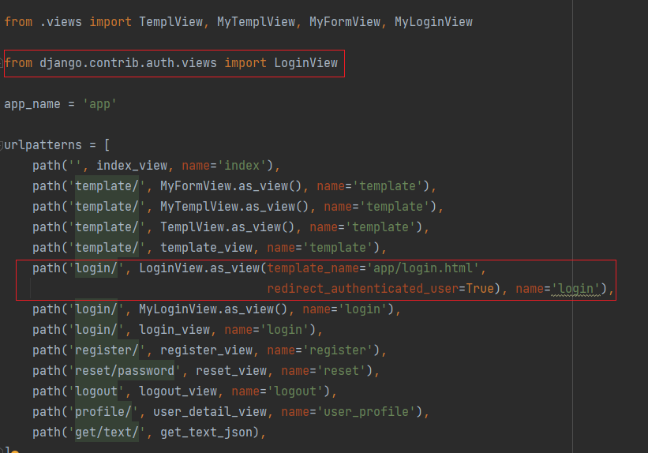

И данный подход будет аналогично работать, как и `MyLoginView`

# 2. Сброс пароля через отправку по email

Для работы с отправкой сообщений через email необходимо в `settings.py` прописать бэкенд

## 2.1 Тестовый бекенд

В `settings.py` после `AUTHENTICATION_BACKENDS` пропишите 

```python
EMAIL_BACKEND = 'django.core.mail.backends.console.EmailBackend' # Пример настроек для использования консольного бэкенда (для тестирования)
```

В данном случае данный EMAIL_BACKEND ('django.core.mail.backends.console.EmailBackend') удобен для тестирования отправки, так как само письмо отправиться не на 
адрес, а в консоль.

Затем в корневой `urls.py` папки `project` пропишем встроенные классы представления
отвечающие за сброс пароля и всю эту логику

```python
from django.contrib.auth import views as auth_views

urlpatterns = [
    # ...
    path('password_reset/',
         auth_views.PasswordResetView.as_view(template_name="app/password_reset_form.html",
                                              email_template_name="app/password_reset_email.html"),
         name='password_reset'),
    path('password_reset/done/',
         auth_views.PasswordResetDoneView.as_view(template_name="app/password_reset_done.html"),
         name='password_reset_done'),
    path('reset/<uidb64>/<token>/',
         auth_views.PasswordResetConfirmView.as_view(template_name="app/password_reset_confirm.html"),
         name='password_reset_confirm'),
    path('reset/done/',
         auth_views.PasswordResetCompleteView.as_view(template_name="app/password_reset_complete.html"),
         name='password_reset_complete'),
]
```

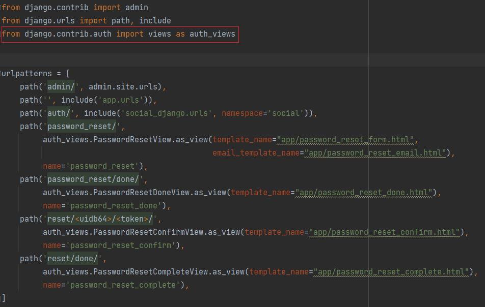

Для полноценной встроенной логики сброса пароля при помощи email используется 4 класса представления

| Класс представление       | имя маршрута (name)     | Описание                                                                               |
|---------------------------|-------------------------|----------------------------------------------------------------------------------------|
| PasswordResetView         | password_reset          | Класс представление для отображения формы сброса пароля                                |
| PasswordResetDoneView     | password_reset_done     | Класс представление для отображения HTML сообщения о отправке ссылки о сбросе на email |
| PasswordResetConfirmView  | password_reset_confirm  | Класс представление для отображения формы ввода нового пароля                          |
| PasswordResetCompleteView | password_reset_complete | Класс представление для отображения HTML сообщения об успешном изменении пароля        |

По умолчанию Django использует формы и отображения от админ панели, если необходимо использовать свои формы (как в нашем случае),
то необходимо создать 5 шаблонов:

* `password_reset_form.html`: Форма для ввода адреса электронной почты для сброса пароля.
* `password_reset_email.html`: Шаблон письма со ссылкой для сброса пароля.
* `password_reset_done.html`: Страница, показываемая после отправки формы сброса пароля.
* `password_reset_confirm.html`: Форма для ввода нового пароля.
* `password_reset_complete.html`: Страница, показываемая после успешного сброса пароля.

Если в папке `app/tempalates/app` не нашли указанные 5 шаблонов HTML, `то скачайте их с курса на dl-ido,
под ссылкой на репозиторий с 4-5 практикой`, а затем скопируйте эти шаблоны в указанную папку (`app/tempalates/app`)

Ну и наконец, в шаблоне `login.html` пропишем ссылку на форму сброса пароля, чтобы было удобно на неё переходить.

```python
href=""
```

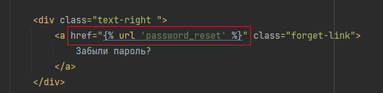

Теперь всё протестируем.

Перейдите на форму авторизации http://127.0.0.1:8000/login/ (если не переходит, то разлогиньтесь)

Далее нажимаем на `Забыли пароль`

Вводим email `user@test.ru` именно такой email у пользователя `user` с паролем `user`

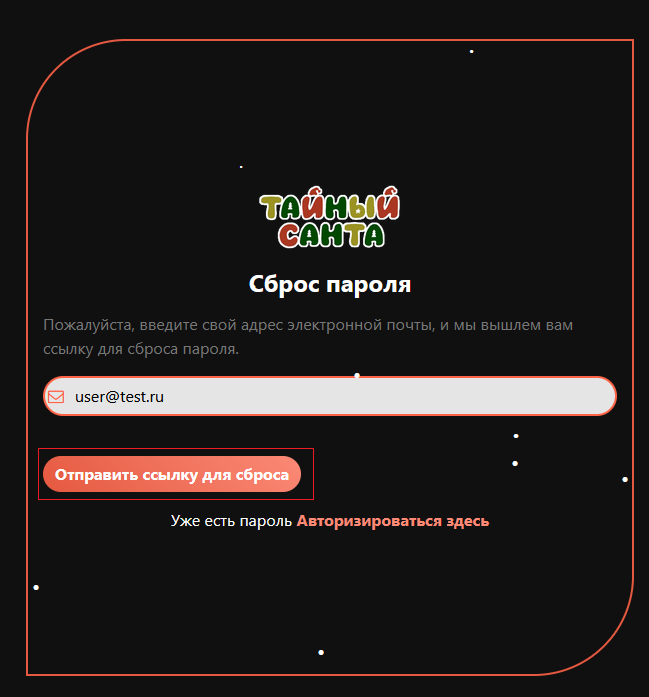


Затем проверяем наш `email` (на самом деле консоль), там будет ссылка, переходим по ней

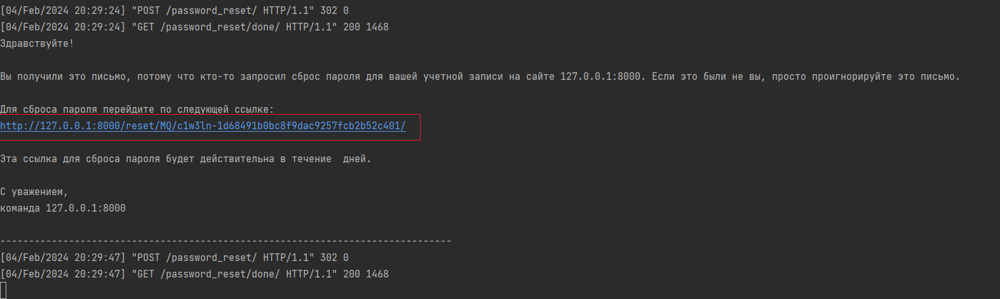

Далее появится форма со сменой пароля, вбиваем новый пароль, повторяем его. Помните пароль должен быть
не простой, стандартной достаточно такого пароля, змейка с зажатым `shift` от `1` до `z`, затем с `x` до `2`

В общем пароль будет `!QAZXSW@`

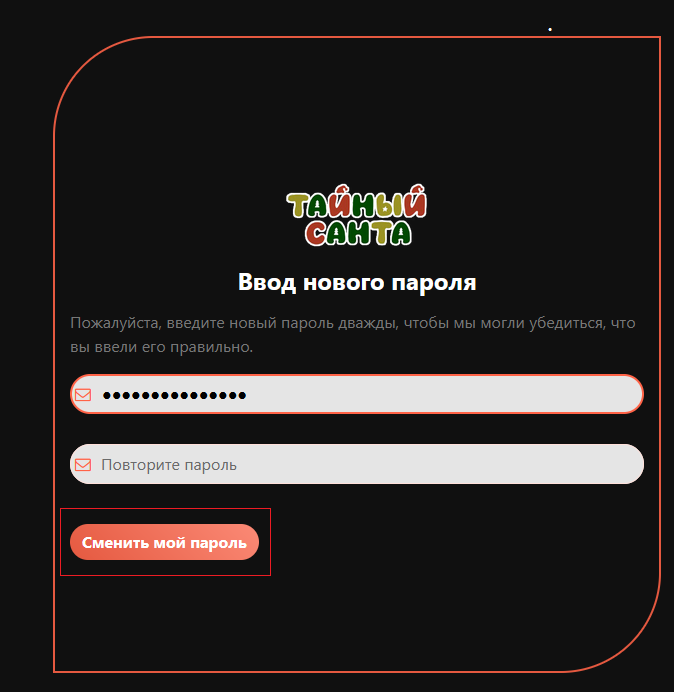

Теперь у пользователя `user` будет пароль не `user`, а `!QAZXSW@` или тот, что вы вбили

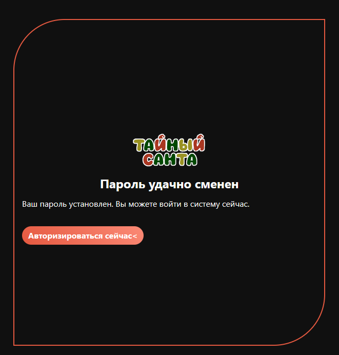

Можете авторизироваться под user и проверить, что пароль сменился.

## 2.2 Бекенд с использованием SMTP

SMTP (Simple Mail Transfer Protocol — простой протокол передачи почты) — это стандартный протокол, 
используемый для отправки электронной почты в сетях TCP/IP, включая интернет. 
SMTP определяет правила коммуникации между почтовыми серверами для передачи 
электронных писем от отправителя к получателю, а также между почтовым клиентом 
(например, Outlook, Apple Mail, Gmail) и почтовым сервером при отправке электронного
письма. 

Кто хочет, может поискать реальный SMTP, зарегистрироваться на сервисе в нём и 
использовать его для отправки реальных сообщений. В рамках курса будем использовать только эмуляцию
при помощи сервиса https://ethereal.email/

Для этого создайте на сервисе почтовый аккаунт 

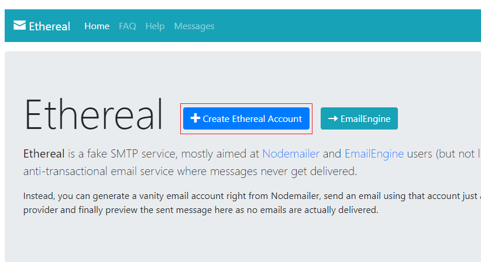

Не закрывайте открывшуюся вкладку, так как её будет не восстановить и нужно будет делать новый аккаунт

Далее долистайте до строки `SMTP configuration` где будут нужные данные для подключения.

В `settings.py` под `EMAIL_BACKEND` пропишите

```python
EMAIL_BACKEND = 'django.core.mail.backends.smtp.EmailBackend'
EMAIL_HOST = 'smtp.ethereal.email'
EMAIL_HOST_USER = ''
EMAIL_HOST_PASSWORD = ''
EMAIL_PORT = '587'
EMAIL_USE_TLS = True
```

Затем возьмите `Ваши` данные с сервиса и подставьте к себе в `settings.py`

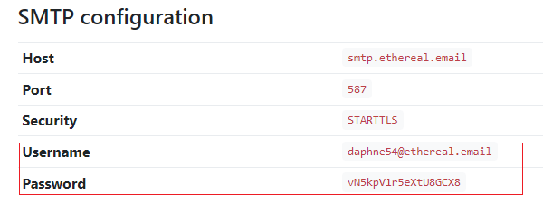

В `settings.py` это выглядит так

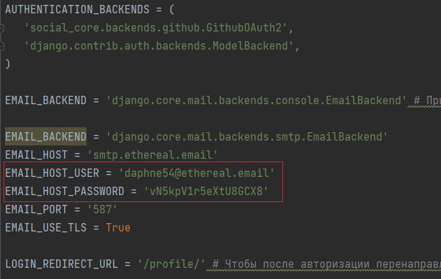

Теперь самое главное. Нужно зарегистрировать пользователя с той почтой, что писали в `EMAIL_HOST_USER` в
`settings.py`.

Если при регистрации вылезла ошибка, множественного бэкенда

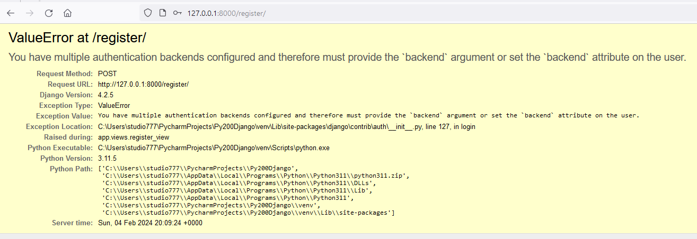

То необходимо в `register_view` в `views.py` у login прописать `backend='django.contrib.auth.backends.ModelBackend'` (если вдруг не прописали ранее)

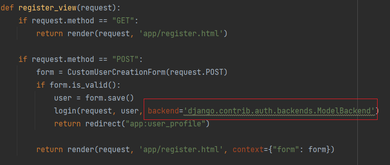

После этого заново регистрировать пользователя не нужно, он уже есть в базе.

Теперь делаем по прошлым шагам, идём на вкладку авторизации, далее на вкладку 
восстановления пароля, затем вводим `email` этого нового пользователя,
а далее в консоли ничего не появляется, хотя сказано проверить почту.

Идём на вкладку где брали данные для подключения, и открываем почтовый ящик

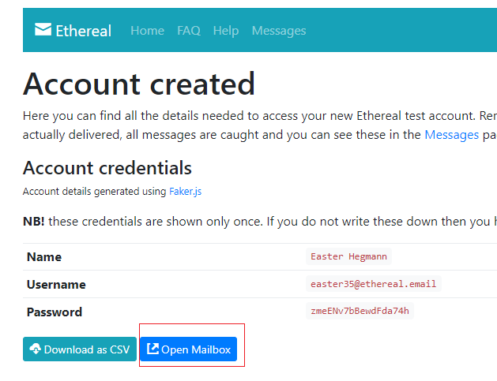

Здесь будет письмо, которое нужно открыть

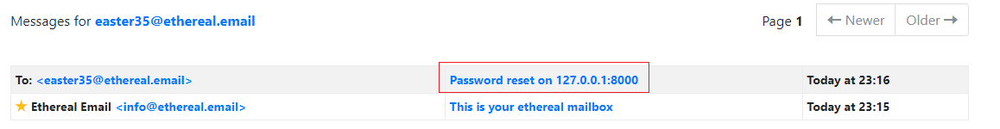

И уже здесь переходим по ссылке и изменяем пароль у пользователя.


На данный момент практика закончена. Далее идёт описание зачетного задания.

# 3. Зачетное задание

В качестве зачетного задания вам необходимо выбрать страницу LandingPage с формой(любой),
затем на ваше усмотрение создать класс отображение или на базе View или TemplateView или 
FormView для работы с выбранной вами страницей.

### Где взять страницы?

Страницу с формой можно взять из предложенных ниже страниц или выбрать самостоятельно на https://templatemo.com/tag/landing-page или 
https://www.free-css.com/template-categories/one-page (сложно найти короткий шаблон) или других ресурсах,
главное, чтобы там была любая форма.

Для облегчения поиска можно выбрать любую из:

`templatemo.com`:

* https://templatemo.com/tm-475-holiday
* https://templatemo.com/tm-493-snapshot
* https://templatemo.com/tm-451-modest
* https://templatemo.com/tm-446-boxer
* https://templatemo.com/tm-588-ebook-landing
* https://templatemo.com/tm-540-lava-landing-page
* https://templatemo.com/tm-474-app-landing
* https://templatemo.com/tm-537-art-factory
* https://templatemo.com/tm-535-softy-pinko

`free-css.com`:

* https://www.free-css.com/free-css-templates/page292/simply-amazed
* https://www.free-css.com/free-css-templates/page291/nano-folio
* https://www.free-css.com/free-css-templates/page296/carvilla
* https://www.free-css.com/free-css-templates/page295/antique-cafe
* https://www.free-css.com/assets/files/free-css-templates/preview/page291/edu-meeting/
* https://www.free-css.com/free-css-templates/page295/applight
* https://www.free-css.com/assets/files/free-css-templates/preview/page291/atlas/
* https://www.free-css.com/free-css-templates/page296/browny
* https://www.free-css.com/assets/files/free-css-templates/preview/page290/digimedia/

В `templatemo.com` можно посмотреть (если это необходимо) и скачать исходники

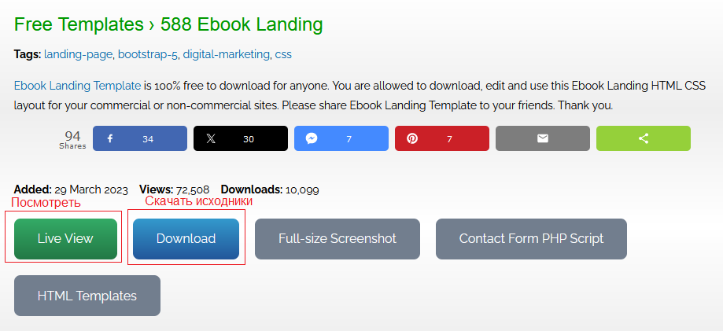

В `free-css.com` можно посмотреть (если это необходимо) и скачать исходники

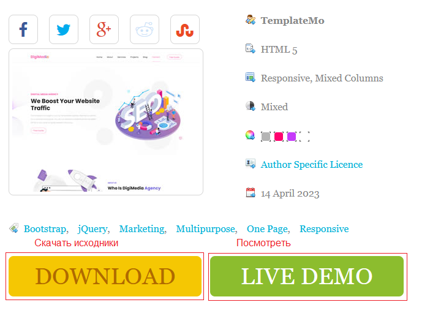

### Что нужно сделать?

После того как скачали понравившийся шаблон, то:

1. Создаём новое приложение `landing` 

```python
python manage.py startapp landing
```

2. Регистрируем это приложение в `settings.py` в INSTALLED_APPS

```python
INSTALLED_APPS = [
    # остальные приложения,
    `landing`,
]
```


3. В папке `landing` создаём `urls.py` и переносим туда следующий код

```python
from django.urls import path

urlpatterns = [
    # TODO добавьте здесь маршрут для вашего обработчика отображения страницы приложения landing 
]
```


4. В папке `landing` создайте папку `static` и `templates`, в папке `static` и `templates` 
создайте папку `landing`. Затем поместите в соответствующие папки `landing/static/landing` - статические файлы 
из вашего архива шаблона, что скачивали, а в `landing/tempalates/landing` - HTML страницу(ы)

Выглядеть это будет примерно так

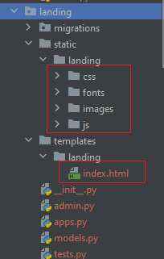


5. В корневом `urls.py` в папке `project` допишите путь include

```python
urlpatterns = [
    # ...
    path('landing/', include('landing.urls')),
]
```

6. Создайте свою форму в файле `forms.py`(его нужно создать) приложения `landing`. Посмотрите какие поля
и как они называются в вашем шаблоне приложения `landing`. Помните, что название поля в
шаблоне должно быть одинаковым с значением поля `name` в вашей HTML форме у тега 
`<input>` (как пример `<input name=my_text>`, значит у форы поле должно называться `my_text`)


7. Затем создайте класс отображение или на базе `View` или `TemplateView` или 
`FormView` для работы с выбранной вами страницей. Зарегистрируйте это отображение в 
`urls.py` своего приложения.


8. Сделайте так, чтобы шаблон нормально отображался (придётся вспомнить про ``, 
не забудьте вверху своего шаблона импортировать ``, всё это можно посмотреть 
как сделано в `app/templates/app/index.html`).


9. Сделайте так, чтобы после успешной отправки данных из формы, должен появиться 
JsonResponse не только с данными отправленными на сервер, но и с данными об IP с которого отправили запрос и 
информации о системе и браузере (user-agent)

Эту всю информацию можете получить из заголовков

```python
# Заголовок HTTP_X_FORWARDED_FOR используется для идентификации исходного IP-адреса клиента, 
# который подключается к веб-серверу через HTTP-прокси или балансировщик нагрузки.
x_forwarded_for = request.META.get('HTTP_X_FORWARDED_FOR')
if x_forwarded_for:
    ip = x_forwarded_for.split(',')[0]  # Получение IP
else:
    ip = request.META.get('REMOTE_ADDR')  # Получение IP

user_agent = request.META.get('HTTP_USER_AGENT')  
```

Вот как пример получаемая информация с сервера после отправки данных с формы

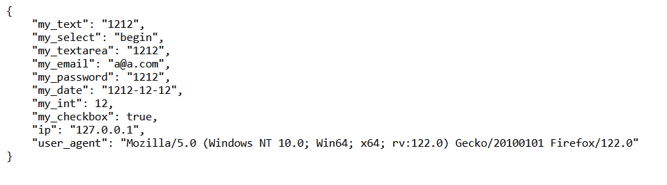


### Завершение
   
После успешного выполнения задания - сделайте коммит, отправьте на github и 
отправьте ссылку на ваш репозиторий вашем практическому преподавателю.
